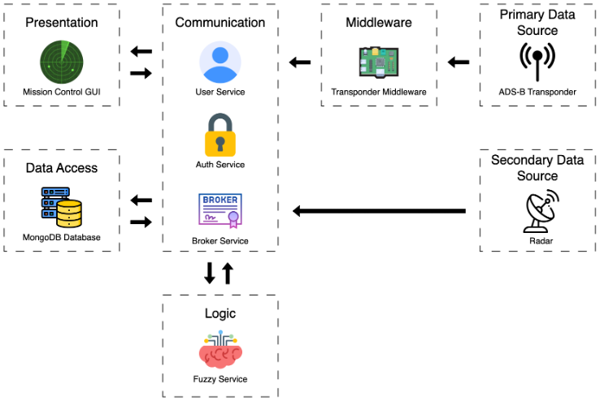

# ADS-B RESTful Data Exchange

> **WSU Vancouver CS Capstone · 2023 – 2025**  
> Industry sponsor: **Sagetech Avionics**

A micro‑service platform that **collects, stores, and brokers ADS‑B flight data in real time**.  
The system is split into purpose‑built services to keep each concern simple and independently deployable.

## Table of Contents

<!--toc:start-->

- [Architecture](#architecture)
- [Quick Start](#quick-start)
  - [Prerequisites](#prerequisites)
  - [Local Setup](#local-setup)
- [API Specification](#api-specification)
- [Testing & Linting](#testing--linting)
- [Authors](#authors)

<!--toc:end-->

<!-- ARCHITECTURE -->

## Architecture



| Service | Stack | Purpose |
|---------|------|---------|
| **Broker** | Node 20 · Express · WS | Aggregate, process and distribute flight data |
| **User**   | Node 20 · Express | Account / ground‑station registry |
| **Auth**   | Node 20 · Express · JWT | OAuth 2 · JWT issuance & refresh |
| **Fuzzy**  | Node 20 · WS | Detect runway utilisation |

> **Docs:** Each service ships a standalone README with API reference, environment keys, and run scripts.  
>
> *Broker →* [`/brokerService/README.md`](brokerService/README.md)  
> *User →* [`/usersService/README.md`](usersService/README.md)  
> *Auth →* [`/oauthService/README.md`](oauthService/README.md)  
> *Fuzzy →* [`/fuzzyService/README.md`](fuzzyService/README.md)  

<!-- QUICK START -->

## Quick Start

### Prerequisites

- [Node.js](https://nodejs.org/en/download/) (v20.11.1 or above)
- [MongoDB](https://www.mongodb.com/try/download/community) (v8.0.4 or above)

### Local Setup
```bash
# 1. Clone
git clone https://git.sagetech.com/wsu-captsone/ads-b-restful-data-exchange.git
cd ads-b-restful-data-exchange

# 2. Install dependencies
npm run install-all

# 3. Configure environment
# see docs for each service

# 4. Launch all services (dev mode, hot‑reload)
npm run dev
```

<!-- TESTING & LINTING -->

## Testing & Linting

Run unit tests for all services:
```bash
npm run test
```
Lint all JavaScript:
```bash
npm run lint
```

<!-- API SPECIFICATION -->

## API Specification

The Broker service acts as an **API gateway**, forwarding client requests to internal services
(User, Auth) and exposing public-facing endpoints for data subscriptions and message routing.

You can view the full OpenAPI specification below:

[📄 View OpenAPI Specification](./openapi.yaml)

Each service maintains its own OpenAPI spec. This repository aggregates them:

- [📘 Broker OpenAPI](./brokerService/openapi.yaml)
- [👤 User OpenAPI](./usersService/openapi.yaml)
- [🔐 Auth OpenAPI](./oauthService/openapi.yaml)

<!-- AUTHORS -->

## Authors

### 2023-2024 Cohort

- Alexander Flores
- Satchel Hamilton
- Joshua Mathwich
- Janna Tanninen

### 2024-2025 Cohort

- Joe Barteluce
- Elijah Delavar
- Matthew Lehner
- Joey Pandina
- Nate Shaw
- Justin Sprecco
